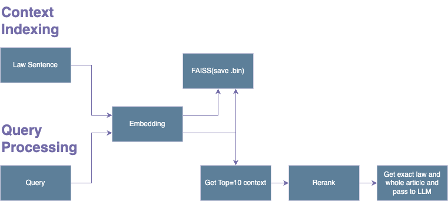

# 🕊️ Legal Q&A Bot (KZ Laws AI Q&A)

Telegram bot that retrieves legal information using a FastAPI backend.  

## Architecture

## Setup & Run

### 1️. Prerequisites  
- **Docker & Docker Compose** installed  
- **Telegram Bot Token** (Get from [BotFather](https://t.me/botfather))  
- **Groq API Key** for query formalization  

### 2️. Configuration  

Create a `.env` file in the project root:  

```ini
TELEGRAM_BOT_TOKEN=your_telegram_bot_token  
FASTAPI_URL=http://fastapi_app:8000/query/  
GROQ_API_KEY=your_groq_api_key  
```
### 3️. Run the app

```bash
docker-compose up --build -d
```

### 4. Stop the app

```bash
docker-compose down
```
### 5️. Usage
- Start the bot in Telegram: /start
- Send a question to get relevant information.